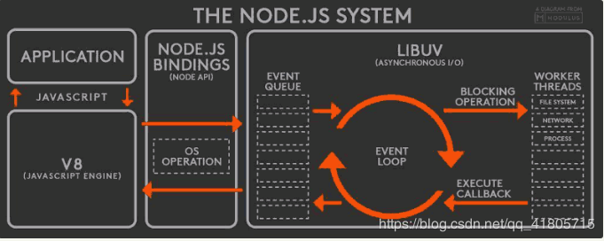

# Event loop

JavaScript是一个单进程的语言，同一时间不能处理多个任务, 所以每完成一个任务去检查下一个要执行的内容的过程，被称为Event Loop

## 在浏览器中的表现

从网上copy过来的一个栗子🌰

```javascript
const $inner = document.querySelector('#inner')
const $outer = document.querySelector('#outer')

function handler () {
  console.log('click') // 直接输出

  Promise.resolve().then(_ => console.log('promise')) // 注册微任务

  setTimeout(_ => console.log('timeout')) // 注册宏任务

  requestAnimationFrame(_ => console.log('animationFrame')) // 注册宏任务

  $outer.setAttribute('data-random', Math.random()) // DOM属性修改，触发微任务
}

new MutationObserver(_ => {
  console.log('observer')
}).observe($outer, {
  attributes: true
})

$inner.addEventListener('click', handler)
$outer.addEventListener('click', handler)
```

如果点击#inner，其执行顺序一定是：click -> promise -> observer -> click -> promise -> observer -> animationFrame -> animationFrame -> timeout -> timeout。

按照代码中的注释，在同步的代码已经执行完以后，这时就会去查看是否有微任务可以执行，然后发现了Promise和MutationObserver两个微任务，遂执行之。

因为click事件会冒泡，所以对应的这次I/O会触发两次handler函数(一次在inner、一次在outer)，所以会优先执行冒泡的事件(早于其他的宏任务)，也就是说会重复上述的逻辑。
在执行完同步代码与微任务以后，这时继续向后查找有木有宏任务。

需要注意的一点是，因为我们触发了setAttribute，实际上修改了DOM的属性，这会导致页面的重绘，而这个set的操作是同步执行的，也就是说requestAnimationFrame的回调会早于setTimeout所执行。

**注意：**

如果将手动点击DOM元素的触发方式变为$inner.click()，那么会得到不一样的结果。
在Chrome下的输出顺序大致是这样的：

click -> click -> promise -> observer -> promise -> animationFrame -> animationFrame -> timeout -> timeout。

MutationObserver的监听不会说同时触发多次，多次修改只会有一次回调被触发。

## 在Node中的表现

Node.js也是单线程的Event Loop，但是它的运行机制不同于浏览器



运行机制如下

1. V8引擎解析JavaScript脚本
2. 解析后的代码，调用Node API
3. libuv库负责Node API的执行。它将不同的任务分配给不同的线程，形成一个Event Loop（事件循环），以异步的方式将任务的执行结果返回给V8引擎
4. V8引擎再将结果返回给用户

Node新增了两个方法可以用来使用：微任务的process.nextTick以及宏任务的setImmediate。

### setImmediate与setTimeout的区别

在官方文档中的定义，setImmediate为一次Event Loop执行完毕后调用。
setTimeout则是通过计算一个延迟时间后进行执行。

如果在主进程中直接执行这两个操作，很难保证哪个会先触发。

### process.nextTick

这个可以认为是一个类似于Promise和MutationObserver的微任务实现，在代码执行的过程中可以随时插入nextTick，并且会保证在下一个宏任务开始之前所执行。

举个栗子🌰

```javascript
class Lib extends require('events').EventEmitter {
  constructor () {
    super()

    this.emit('init')
  }
}

const lib = new Lib()

lib.on('init', _ => {
  // 这里将永远不会执行
  console.log('init!')
})
```

但是

```javascript
class Lib extends require('events').EventEmitter {
  constructor () {
    super()

    process.nextTick(_ => {
      this.emit('init')
    })

    // 同理使用其他的微任务
    // 比如Promise.resolve().then(_ => this.emit('init'))
    // 也可以实现相同的效果
  }
}
```

这样会在主进程的代码执行完毕后，程序空闲时触发Event Loop流程查找有没有微任务，然后再发送init事件。

循环调用process.nextTick会导致报警，后续的代码永远不会被执行,相当于在每次循环执行中都对任务队列追加新的操作，这样循环永远也不会结束

