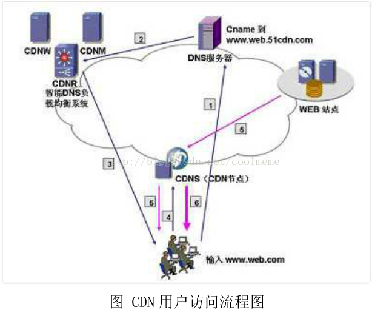
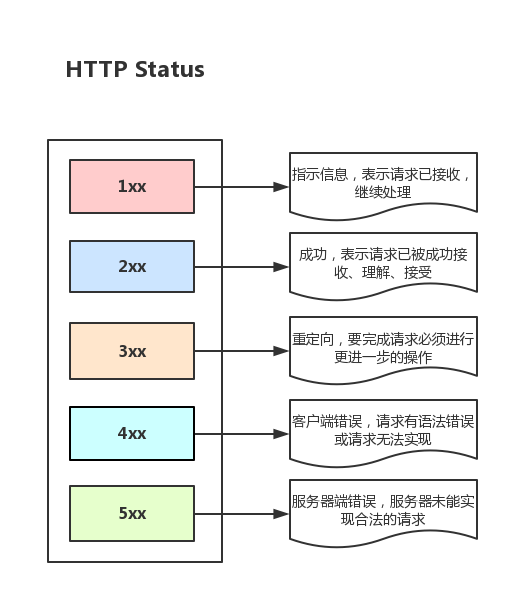
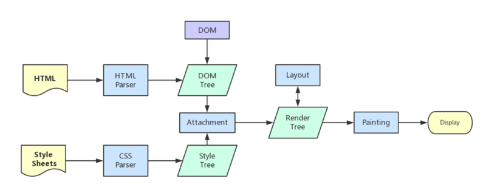
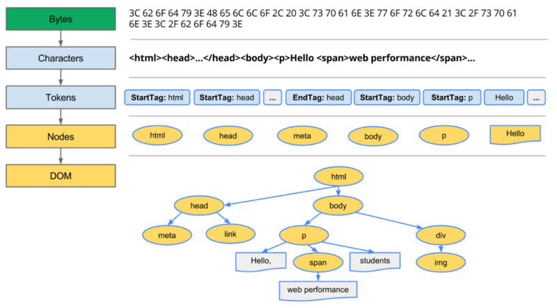
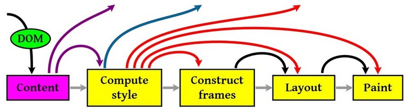
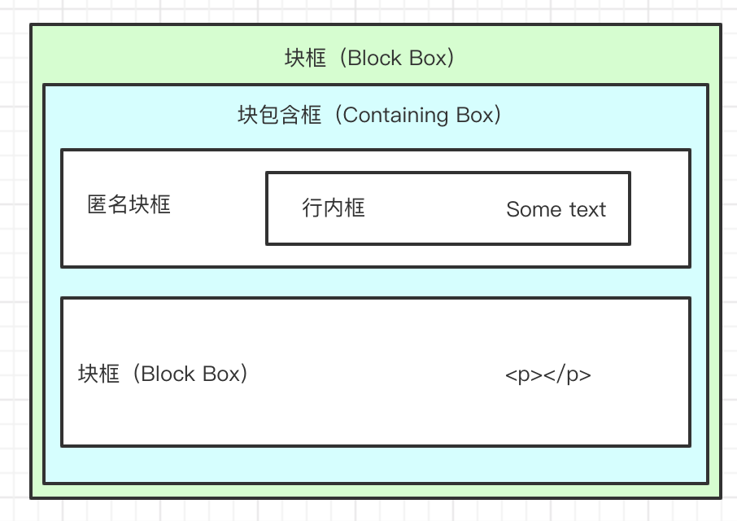

# 从输入URL到页面加载的过程

(参考资料：[https://segmentfault.com/a/1190000012925872#articleHeader16](https://segmentfault.com/a/1190000012925872#articleHeader16) )

## 第一步：从浏览器接收url到开启网络请求线程

### 多进程的浏览器

(参考资料：[https://blog.csdn.net/m0_37972557/article/details/86670632](https://blog.csdn.net/m0_37972557/article/details/86670632) )

- 浏览器是多进程的,有一个主控进程
- 浏览器之所以能够运行,是因为系统给它的进程分配了资源(cpu、内存)
- 每打开一个页面，就相当于创建了一个独立的进程
- 根据浏览器的优化策略，有时多个页面的进程会被合并

#### 进程可能包括主控进程，插件进程，GPU，tab页（浏览器内核）等等

- Browser进程：浏览器的主进程（负责调度），只有一个。
  - 负责浏览器的界面显示，与用户交互。如前进，后退等
  - 负责各个页面的管理，创建和销毁其他进程
  - 将Renderer进程得到的内存中的Bitmap，绘制到用户界面上
  - 网络资源的下载，管理等
- 第三方插件进程：每种类型的插件对应一个进程，仅当使用该插件的时候才创建
- GPU进程：最多一个，用于WebGL ，3D绘制等
- 浏览器渲染进程（Renderer进程）：默认每个页面一个进程，互不影响。主要负责
  - 页面渲染，js脚本执行，事件处理，定时器等

注：[Bitmap](../计算机基础/Bitmap.md)可以理解为通过一个bit数组来存储特定数据的一种数据结构

#### 浏览器多进程的优势

- 避免单个页面崩溃导致整个浏览器崩溃
- 避免第三方插件崩溃导致整个浏览器崩溃
- 充分利用多核优势，提升性能
- 方便使用沙盒模型隔离插件等进程，提高浏览器稳定性

另：[浏览器沙盒模型](../计算机基础/沙盒模型.md)是浏览器将网页的运行限制在一个特定的环境中，也就是一个沙箱中，使它只能访问有限的功能的一种安全机制

#### Renderer进程

先看Renderer进程包含哪些常驻线程:

- GUI渲染线程
  - 负责渲染浏览器界面，解析HTML，CSS，构建DOM树和RenderObject树，布局和绘制等
  - 当界面需要重绘时，或者由于某种操作引发回流时，该线程就会执行
  - GUI渲染线程与JS引擎线程是互斥的，当JS引擎执行时GUI线程会被挂起，GUI更新会被保存在一个队列中等待JS引擎空闲时立即被执行
- JS引擎线程 也称为JS内核，负责处理JS脚本程序
  - JS引擎一直等待着任务队列中任务的到来，然后加以处理，一个Renderer进程中无论什么时候只有一个JS线程在运行
  - GUI渲染线程与JS引擎线程是互斥的，所以如果JS引擎的执行时间过程，这样就会造成页面的渲染不连贯，导致页面渲染加载阻塞
- 事件触发线程
  - 归属于浏览器而不是JS引擎，用来控制事件循环（可以理解，JS引擎自己都忙不过来，需要浏览器另开线程协助）
  - 当JS引擎执行代码块如setTimeOut时（也可来自浏览器内核的其他线程,如鼠标点击、AJAX异步请求等），会将对应任务添加到事件线程中
  - 当对应的事件符合触发条件被触发时，该线程会把事件添加到待处理队列的队尾，等待JS引擎的处理
  - 注意，由于JS的单线程关系，所以这些待处理队列中的事件都得排队等待JS引擎处理（当JS引擎空闲时才会去执行）
- 定时触发器线程
  - 传说中的setInterval与setTimeout所在线程
  - 浏览器定时计数器并不是由JavaScript引擎计数的,（因为JavaScript引擎是单线程的, 如果处于阻塞线程状态就会影响记计时的准确）
  - 因此通过单独线程来计时并触发定时（计时完毕后，添加到事件队列中，等待JS引擎空闲后执行）
  - 注意，W3C在HTML标准中规定，规定要求setTimeout中低于4ms的时间间隔算为4ms。
- 异步http请求线程
  - 在XMLHttpRequest在连接后是通过浏览器新开一个线程请求
  - 将检测到状态变更时，如果设置有回调函数，异步线程就产生状态变更事件，将这个回调再放入事件队列中。再由JavaScript引擎执行。

### 解析URL

#### 输入URL后，会进行解析（URL的本质就是统一资源定位符）

URL一般包括几大部分：

- protocol，协议头，譬如有http，ftp等
- host，主机域名或IP地址
- port，端口号
- path，目录路径
- query，即查询参数
- fragment，即#后的hash值，一般用来定位到某个位置

#### 网络请求都是单独的线程

每次网络请求时都需要开辟单独的线程进行，譬如如果URL解析到http协议，就会新建一个网络线程去处理资源下载

因此浏览器会根据解析出得协议，开辟一个网络线程，前往请求资源

[参考资料：从浏览器多进程到JS单线程，JS运行机制最全面的一次梳理](https://segmentfault.com/a/1190000012925872)

## 第二步：开启网络线程到发出一个完整的http请求

### DNS查询得到IP

#### 域名组成

[http://www.example.e1.com:80/path/to/myfile.html?key1=value1&key2=value2#SomewhereInTheDocument](http://www.example.e1.com:80/path/to/myfile.html?key1=value1&key2=value2#SomewhereInTheDocument)

- `http://:`这个是协议，也就是HTTP超文本传输协议，也就是网页在网上传输的协议。
  - 还有安全协议 HTTPS.其他协议还有
  - mailto:用户打开邮箱的客户端
  - ftp:用来做文件的转换,
  - file用来获取文件,
  - data获取外部资源等
- www.example.e1.com 域名，标明了需要请求的服务器的地址.
  - 其中标号com是顶级域名，标号e1是二级域名，标号example是三级域名
- WWW(World Wide Weh,万维网)是基于客户机/服务器方式的信息发现技术和超文本技术的综合。
- :80 端口 整数，可选，省略时使用方案的默认端口，各种传输协议都有默认的端口号，如http的默认端口为80。如果输入时省略，则使用默认端口号。有时候出于安全或其他考虑，可以在服务器上对端口进行重定义，即采用非标准端口号，此时，URL中就不能省略端口号这一项。
- path/to/myfile.html 路径 由零或多个“/”符号隔开的字符串，一般用来表示主机上的一个目录或文件地址。
- ?key1=value1&key2=value2 参数 这是用于指定特殊参数的可选项。
- #SomewhereInTheDocument 片段 字符串，用于指定网络资源中的片断。例如一个网页中有多个名词解释，可使用fragment直接定位到某一名词解释。

#### 域名只是逻辑概念，并不代表计算机所在的物理地点

据2006年12月统计，现在顶级域名TLD(Top Level Domain)已有265个，分为三大类：

- 国家顶级域名nTLD：采用ISO3166的规定。如：cn代表中国，us代表美国，uk代表英国，等等。国家域名又常记为ccTLD(cc表示国家代码contry-code)。
- 通用顶级域名gTLD：最常见的通用顶级域名有7个，即：com(公司企业)，net(网络服务机构)，org(非营利组织)，int(国际组织)，gov(美国的政府部门)，mil(美国的军事部门)。
- 基础结构域名(infrastructure domain)：这种顶级域名只有一个，即arpa，用于反向域名解析，因此称为反向域名。

#### 查询步骤

- 会首先搜索浏览器自身的DNS缓存（缓存时间比较短，大概只有1分钟，且只能容纳1000条缓存），看自身的缓存中是否有`http://www.example.e1.com` 对应的条目，而且没有过期，如果有且没有过期则解析到此结束。

注：我们怎么查看Chrome自身的缓存？可以使用 chrome://net-internals/#dns 来进行查看

- 如果浏览器自身的缓存里面没有找到对应的条目，那么Chrome会搜索操作系统自身的DNS缓存,如果找到且没有过期则停止搜索解析到此结束.

注：怎么查看操作系统自身的DNS缓存，以Windows系统为例，可以在命令行下使用 ipconfig /displaydns 来进行查看  

- 如果在Windows系统的DNS缓存也没有找到，那么尝试读取hosts文件（位于C:\Windows\System32\drivers\etc），看看这里面有没有该域名对应的IP地址，如果有则解析成功。

- 如果在hosts文件中也没有找到对应的条目，浏览器就会发起一个DNS的系统调用，就会向本地配置的首选DNS服务器（一般是电信运营商提供的，也可以使用像Google提供的DNS服务器）发起域名解析请求（通过的是UDP协议向DNS的53端口发起请求，这个请求是递归的请求，也就是运营商的DNS服务器必须得提供给我们该域名的IP地址），
  - 运营商的DNS服务器首先查找自身的缓存，找到对应的条目，且没有过期，则解析成功。
  - 如果没有找到对应的条目，则有运营商的DNS代我们的浏览器发起迭代DNS解析请求，它首先是会找根域的DNS的IP地址（这个DNS服务器都内置13台根域的DNS的IP地址），找打根域的DNS地址，就会向其发起请求（请问`http://www.example.e1.com`这个域名的IP地址是多少啊？）
  - 根域发现这是一个顶级域com域的一个域名，于是就告诉运营商的DNS我不知道这个域名的IP地址，但是我知道com域的IP地址，你去找它去，
  - 于是运营商的DNS就得到了com域的IP地址，又向com域的IP地址发起了请求（请问`http://www.example.e1.com`这个域名的IP地址是多少?）
  - com域这台服务器告诉运营商的DNS我不知道`http://www.example.e1.com`这个域名的IP地址，但是我知道`example.e1.com`这个域的DNS地址，你去找它去
  - 于是运营商的DNS又向`example.e1.com`这个域名的DNS地址（这个一般就是由域名注册商提供的，像万网，新网等）发起请求（请问`www.example.e1.com`这个域名的IP地址是多少？）
  - 这个时候`example.e1.com`域的DNS服务器一查，诶，果真在我这里，于是就把找到的结果发送给运营商的DNS服务器
  - 这个时候运营商的DNS服务器就拿到了`www.example.e1.com`这个域名对应的IP地址，并返回给Windows系统内核，内核又把结果返回给浏览器，终于浏览器拿到了`www.example.e1.com`  对应的IP地址，该进行一步的动作了。

#### cdn

注意，域名查询时有可能是经过了CDN调度器的（如果有cdn存储功能的话）

- CDN网络是在用户和服务器之间增加Cache层，如何将用户的请求引导到Cache上获得源服务器的数据，主要是通过接管DNS实现，这就是CDN的最基本的原理
- 每个CDN节点由两部分组成:负载均衡设备和高速缓存服务器



#### 抽象版

> - 用户：我要访问`http://www.example.e1.com`
> - 浏览器：我找找我自己的库存（DNS缓存），找到了，还是新的
> - —— 结束——
> - 浏览器:没有能用的唉，我问问本地操作系统大哥
> - 操作系统: 找到了，还是新的
> - —— 结束——
> - 操作系统:我这没有，我看看hosts文件里有没有对应的ip
> - 操作系统:找到了
> - —— 结束——
> - 操作系统:还是没有
> - 浏览器:好哒，我问问电信大哥（本地配置的首选DNS服务器）
> - 电信:我找找我自己的库存，找到了，还是新的
> - —— 结束——
> - 电信：我这没有唉，但我有根域的DNS的IP地址，我问问
> - 电信：根儿啊，请问`http://www.example.e1.com`这个域名的IP地址是多少啊？
> - 根域: 我不知道这个域名的IP地址，但是我知道com域的IP地址，你去找它去
> - 电信：你好，com，请问`http://www.example.e1.com`这个域名的IP地址是多少?
> - com:我不知道`http://www.example.e1.com`这个域名的IP地址，但是我知道`example.e1.com`这个域的DNS地址，你去找它去
> - 电信:你好，`example.e1.com`，哎呦，这名字真长，请问www.example.e1.com这个域名的IP地址是多少？
> - 域名注册商:诶，真在我这里,给你ip
> - 电信:好哒，么么哒，那谁家的浏览器，这是ip
> - 操作系统: 收到，么么哒，浏览器，诺，ip
> - —— 结束——
> - 域名注册商:不是我家的
> - 电信:那谁家的浏览器,没有啊
> - 操作系统:好哒，我找找最近的聊天记录（NetBIOS name Cache（NetBIOS名称缓存，就存在客户端电脑中的）凡是最近一段时间内和我成功通讯的计算机的计算机名和Ip地址，就都会存在这个缓存里面）
> - 操作系统:啊呀，我们刚刚聊过呀
> - —— 结束——
> - 操作系统：没有呢，我问问WINS 服务器（是NETBIOS名称和IP地址对应的服务器））
> - WINS:找到了
> - —— 结束——
> - WINS:没有
> - 操作系统:ok
> - 操作系统:号外，号外，`http://www.example.e1.com`，听到请回答，听到请回答
> - `http://www.example.e1.com`: ? 找我？
> - —— 结束——
> - —— 无人响应，一片乌鸦飞过 ——
> - 操作系统:额，我看看LMHOSTS文件吧
> - 操作系统:啊呀，竟然在这里，踏破铁鞋无觅处
> - —— 结束——
> - 操作系统:还是没有，浏览器呀，你是不是瓦特了？写错地址了
> - 浏览器:额，我跟用户谈谈
> - —— 结束——

### tcp/ip请求

http的本质就是tcp/ip请求

#### [三次握手，四次分手](../安全防护/tcp三次握手&四次分手.md)

#### tcp/ip的并发限制

浏览器对同一域名下并发的tcp连接是有限制的（2-10个不等）， 而且在http1.0中往往一个资源下载就需要对应一个tcp/ip请求， 所以针对这个瓶颈，又出现了很多的资源优化方案

#### 常用的6大请求方式有：Get、Post、Put、Delete、Option5、Head

- GET：GET可以说是最常见的了，它本质就是发送一个请求来取得服务器上的某一资源。资源通过一组HTTP头和呈现据（如HTML文本，或者图片或者视频等）返回给客户端。GET请求中，永远不会包含呈现数据。
- HEAD：HEAD和GET本质是一样的，区别在于HEAD不含有呈现数据，而仅仅是HTTP头信息。有的人可能觉得这个方法没什么用，其实不是这样的。想象一个业务情景：欲判断某个资源是否存在，我们通常使用GET，但这里用HEAD则意义更加明确。
- PUT：这个方法比较少见。HTML表单也不支持这个。本质上来讲， PUT和POST极为相似，都是向服务器发送数据，但它们之间有一个重要区别，PUT通常指定了资源的存放位置，而POST则没有，POST的数据存放位置由服务器自己决定。
- DELETE：删除某一个资源。基本上这个也很少见，不过还是有一些地方比如amazon的S3云服务里面就用的这个方法来删除资源。
- POST：向服务器提交数据。这个方法用途广泛，几乎目前所有的提交操作都是靠这个完成。
- OPTIONS：这个方法很有趣，但极少使用。它用于获取当前URL所支持的方法。若请求成功，则它会在HTTP头中包含一个名为“Allow”的头，值是所支持的方法，如“GET, POST”。

### 五层因特网协议栈

从客户端发出http请求到服务器接收，中间会经过一系列的流程（服务器的接收就是反过来的步骤）：

- 在应用层发送http请求；（应用层：dns，http，dns解析成ip并发送http请求）
- 到传输层通过三次握手建立tcp/IP连接；（传输层：tcp，udp）
- 到网络层的IP寻址；（网络层：IP，ARP）
- 到数据链路层的封装成帧；（数据链路层：ppp）
- 到物理层的利用物理介质传输；

完整的OSI七层框架，多了会话层和表示层：  物理层、数据链路层、网络层、传输层、会话层、表示层、应用层。

- 表示层：主要处理两个通信系统中交换信息的表示方式，包括数据格式转换，数据加密与解密等
- 会话层：它具体管理不同用户和进程之间的对话，如控制登录和注销过程。


## 第三步：从服务器接收到请求到对应后台接收到请求

### 负载均衡

用户发起的请求都指向调度服务器（反向代理服务器，譬如安装了nginx控制负载均衡），然后调度服务器根据实际的调度算法，分配不同的请求给对应集群中的服务器执行，然后调度器等待实际服务器的HTTP响应，并将它反馈给用户

[nginx反向代理与负载均衡](../nginx/nginx反向代理与负载均衡.md)

#### 它的调度算法

- weight(轮询)

​ 接收到的请求按照顺序逐一分配到不同的后端服务器，即使在使用过程中，某一台服务器宕机，nginx会自动将这台服务器剔除队列，请求受理的情况不会受到任何影响。在这种方式下，可以给不同的后端服务器设置一个权重值，用于调整不同的服务器上请求的分配率，权重数据越大，被分配到的几率越大，该权重值主要是针对实际工作环境中不同的后端服务器硬件配置进行调整的。

- ip_hash

​ 每个请求按照发起客户端的ip的hash结果进行匹配，这样的算法保证了下一个固定ip地址的客户端总是会访问到上一次访问的服务器，这也在一定程度上解决了集群服务器环境下session共享问题。

- fair

​ 动态的根据后端服务器的请求处理到响应的时间进行均衡分配，响应时间短处理效率高的服务器分配到请求的概率高，响应时间长处理效率低的服务器分配到的请求少。默认nginx不支持此算法，需要安装upstream_fair模块。

- url_hash

​ 按照访问的url的hash结果分配请求，每个请求的url会指向后端的固定服务器，可以在nginx作为静态服务器的情况下提高缓存效率，同样nginx也不支持此算法，需要安装hash包。

### 后台的处理

一般后台都是部署到容器中的，所以一般为：

- 先是容器接受到请求（如tomcat容器）
- 然后对应容器中的后台程序接收到请求（如java程序）
- 然后就是后台会有自己的统一处理，处理完后响应响应结果

概括下：

- 一般有的后端是有统一的验证的，如安全拦截，跨域验证
- 如果这一步不符合规则，就直接返回了相应的http报文（如拒绝请求等）
- 然后当验证通过后，才会进入实际的后台代码，此时是程序接收到请求，然后执行（譬如查询数据库，大量计算等等）
- 等程序执行完毕后，就会返回一个http响应包（一般这一步也会经过多层封装）
- 然后就是将这个包从后端发送到前端，完成交互

## 第四步 后台和前台的http交互

### http报文结构

报文一般包括了：`通用头部`，`请求/响应头部`，`请求/响应体`

#### 通用头部

```js
Request Url: 请求的web服务器地址

Request Method: 请求方式
（Get、POST、OPTIONS、PUT、HEAD、DELETE、CONNECT、TRACE）

Status Code: 请求的返回状态码，如200代表成功

Remote Address: 请求的远程服务器地址（会转为IP）
```



#### 请求/响应头部

常用的请求头部（部分）：

```js
Accept: 接收类型，表示浏览器支持的MIME类型
（对标服务端返回的Content-Type）
Accept-Encoding：浏览器支持的压缩类型,如gzip等,超出类型不能接收
Content-Type：客户端发送出去实体内容的类型
Cache-Control: 指定请求和响应遵循的缓存机制，如no-cache
If-Modified-Since：对应服务端的Last-Modified，用来匹配看文件是否变动，只能精确到1s之内，http1.0中
Expires：缓存控制，在这个时间内不会请求，直接使用缓存，http1.0，而且是服务端时间
Max-age：代表资源在本地缓存多少秒，有效时间内不会请求，而是使用缓存，http1.1中
If-None-Match：对应服务端的ETag，用来匹配文件内容是否改变（非常精确），http1.1中
Cookie: 有cookie并且同域访问时会自动带上
Connection: 当浏览器与服务器通信时对于长连接如何进行处理,如keep-alive
Host：请求的服务器URL
Origin：最初的请求是从哪里发起的（只会精确到端口）,Origin比Referer更尊重隐私
Referer：该页面的来源URL(适用于所有类型的请求，会精确到详细页面地址，csrf拦截常用到这个字段)
User-Agent：用户客户端的一些必要信息，如UA头部等
```

常用的响应头部（部分）：

```js
Access-Control-Allow-Headers: 服务器端允许的请求Headers
Access-Control-Allow-Methods: 服务器端允许的请求方法
Access-Control-Allow-Origin: 服务器端允许的请求Origin头部（譬如为*）
Content-Type：服务端返回的实体内容的类型
Date：数据从服务器发送的时间
Cache-Control：告诉浏览器或其他客户，什么环境可以安全的缓存文档
Last-Modified：请求资源的最后修改时间
Expires：应该在什么时候认为文档已经过期,从而不再缓存它
Max-age：客户端的本地资源应该缓存多少秒，开启了Cache-Control后有效
ETag：请求变量的实体标签的当前值
Set-Cookie：设置和页面关联的cookie，服务器通过这个头部把cookie传给客户端
Keep-Alive：如果客户端有keep-alive，服务端也会有响应（如timeout=38）
Server：服务器的一些相关信息
```

#### 请求/响应实体

http请求时，除了头部，还有消息实体

#### CRLF

CRLF（Carriage-Return Line-Feed），意思是回车换行，一般作为分隔符存在

请求头和实体消息之间有一个CRLF分隔，响应头部和响应实体之间用一个CRLF分隔

一般来说（分隔符类别）：

```text
CRLF->Windows-style
LF->Unix Style
CR->Mac Style
```

### 浏览器本地存储方案

#### Cookie

cookie是浏览器的一种本地存储方式，一般用来帮助客户端和服务端通信的，常用来进行身份校验，结合服务端的session使用。

一般来说，cookie是不允许存放敏感信息的（千万不要明文存储用户名、密码），因为非常不安全，如果一定要强行存储，首先，一定要在cookie中设置httponly（这样就无法通过js操作了），另外可以考虑rsa等非对称加密（因为实际上，浏览器本地也是容易被攻克的，并不安全）

另外，由于在同域名的资源请求时，浏览器会默认带上本地的cookie,那么对于一些静态资源并不需要cookie验证，就会带来较为严重的浪费，而且也降低了访问速度

- 优化方案（多域名拆分）
  - 将静态资源分组，分别放到不同的域名下（如static.base.com）
  - 而page.base.com（页面所在域名）下请求时，是不会带上static.base.com域名的cookie的，所以就避免了浪费
- 域名较多时，dns-prefetch（让浏览器空闲时提前解析dns域名，不过也请合理使用，勿滥用）

特点

- 大小受限制，cookie大小被限制在4KB
- cookie的实现是通过扩展HTTP协议实现，cookie存储的内容将保留在请求头中。并且对于同源的请求中，每次cookie都在浏览器和服务器中传输，这样会造成不必要的资源浪费。一般优化的方案是通过拆分服务器域名，将静态资源，请求多的服务器和使用cookie的服务器进行分离.

- 对于服务器来说处理cookie非常方便，但是通过js处理cookie虽然有很多很棒的库帮忙，但是本质上还是通过正则表达式来进行分割处理。

#### SessionStorage

- 大小为5M，可以存储较多的数据。

- sessionStorage与服务器的session类似，它是会话级别的缓存，关闭浏览器后将被清除。

- 不同窗口不可以共享sessionStorage。

- 他非常方便的API。

#### LocalStorage

- 大小为5M，同sessionStorage。

- 他是一种持久化方案，如果说不手动清除得话，数据是不会过期的。
- 不同窗口，非跨域情况可以共享。

### gzip压缩

首先，明确gzip是一种压缩格式，需要浏览器支持才有效（不过一般现在浏览器都支持），
而且gzip压缩效率很好（高达70%左右）

然后gzip一般是由apache、tomcat等web服务器开启

当然服务器除了gzip外，也还会有其它压缩格式（如deflate，没有gzip高效，且不流行）

所以一般只需要在服务器上开启了gzip压缩，然后之后的请求就都是基于gzip压缩格式的，
非常方便。

需要注意的是，GZIP对于压缩图片这部分会大大增加服务器的CPU压力，并且压缩效果也不好，所以不太推荐针对图片进行压缩。

### [关于http](关于http.md)

### [http的缓存](http缓存.md)

## 第五步 浏览器接收到http数据包后的解析流程



### 解析HTML到构建出DOM当然过程可以简述如下

```text
Bytes → characters → tokens → nodes → DOM
```



其中

- `Conversion`转换：浏览器将获得的HTML内容（Bytes）基于他的编码转换为单个字符
- `Tokenizing`分词：浏览器按照HTML规范标准将这些字符转换为不同的标记token。每个token都有自己独特的含义以及规则集
- `Lexing`词法分析：分词的结果是得到一堆的token，此时把他们转换为对象，这些对象分别定义他们的属性和规则
- DOM构建：因为HTML标记定义的就是不同标签之间的关系，这个关系就像是一个树形结构一样

### 生成CSS规则

同理

```text
Bytes → characters → tokens → nodes → DOM
```

### 构建渲染树

一般来说，渲染树和DOM树相对应的，但不是严格意义上的一一对应

因为有一些不可见的DOM元素不会插入到渲染树中，如head这种不可见的标签或者display: none等

### 渲染



回流的成本开销要高于重绘，而且一个节点的回流往往回导致子节点以及同级节点的回流，

#### 什么会引起回流

- 页面渲染初始化

- DOM结构改变，比如删除了某个节点

- render树变化，比如减少了padding

- 窗口resize

- 最复杂的一种：获取某些属性，引发回流，

很多浏览器会对回流做优化，会等到数量足够时做一次批处理回流，
但是除了render树的直接变化，当获取一些属性时，浏览器为了获得正确的值也会触发回流，这样使得浏览器优化无效，包括

- offset(Top/Left/Width/Height)
- scroll(Top/Left/Width/Height)
- cilent(Top/Left/Width/Height)
- width,height
- 调用了getComputedStyle()或者IE的currentStyle

优化方案

- 减少逐项更改样式，最好一次性更改style，或者将样式定义为class并一次性更新
- 避免循环操作dom，创建一个documentFragment或div，在它上面应用所有DOM操作，最后再把它添加到window.document
- 避免多次读取offset等属性。无法避免则将它们缓存到变量
- 将复杂的元素绝对定位或固定定位，使得它脱离文档流，否则回流代价会很高

#### 简单层与复合层

浏览器渲染的图层一般包含两大类：普通图层以及复合图层

- 普通文档流内可以理解为一个复合图层（这里称为默认复合层，里面不管添加多少元素，其实都是在同一个复合图层中）
- absolute布局（fixed也一样），虽然可以脱离普通文档流，但它仍然属于默认复合层。
- 可以通过硬件加速的方式，声明一个新的复合图层，它会单独分配资源

GPU中，各个复合图层是单独绘制的，所以互不影响，

将该元素变成一个复合图层，就是传说中的硬件加速技术

- 最常用的方式：translate3d、translateZ
- opacity属性/过渡动画（需要动画执行的过程中才会创建合成层，动画没有开始或结束后元素还会回到之前的状态）
- will-chang属性（这个比较偏僻），一般配合opacity与translate使用（而且经测试，除了上述可以引发硬件加速的属性外，其它属性并不会变成复合层），

absolute和硬件加速的区别

- absolute虽然可以脱离普通文档流，但是无法脱离默认复合层
- 浏览器最终绘制时，是整个复合层绘制的

一般一个元素开启硬件加速后会变成复合图层，可以独立于普通文档流中，改动后可以避免整个页面重绘，提升性能

但是尽量不要大量使用复合图层，否则由于资源消耗过度，页面反而会变的更卡

使用硬件加速时，尽可能的使用index，防止浏览器默认给后续的元素创建复合层渲染
如果a是一个复合图层，而且b在a上面，那么b也会被隐式转为一个复合图层

### 遇到外链时的处理

当遇到css/js/img的外链时，会单独开启一个下载线程去下载资源（http1.1中是每一个资源的下载都要开启一个http请求，对应一个tcp/ip链接）

- 遇到CSS样式资源
  - CSS下载时异步，不会阻塞浏览器构建DOM树
  - 但是会阻塞渲染，也就是在构建render时，会等到css下载解析完毕后才进行（这点与浏览器优化有关，防止css规则不断改变，避免了重复的构建）
  - 有例外，media query声明的CSS是不会阻塞渲染的
- 遇到JS脚本资源
  - 阻塞浏览器的解析，也就是说发现一个外链脚本时，需等待脚本下载完成并执行后才会继续解析HTML
  - 浏览器的优化，一般现代浏览器有优化，在脚本阻塞时，也会继续下载其它资源（当然有并发上限），但是虽然脚本可以并行下载，解析过程仍然是阻塞的，也就是说必须这个脚本执行完毕后才会接下来的解析，并行下载只是一种优化而已
  - defer与async，普通的脚本是会阻塞浏览器解析的，但是可以加上defer或async属性，这样脚本就变成异步了，可以等到解析完毕后再执行

    defer是延迟执行，而async是异步执行。
- 遇到img图片类资源
  - 异步下载，不会阻塞解析，下载完毕后直接用图片替换原有src的地方

### loaded和domcontentloaded

- DOMContentLoaded 事件触发时，仅当DOM加载完成，不包括样式表，图片(譬如如果有async加载的脚本就不一定完成)
- load 事件触发时，页面上所有的DOM，样式表，脚本，图片都已经加载完成了

## 第六步 CSS的可视化格式模型

- CSS中规定每一个元素都有自己的盒子模型（相当于规定了这个元素如何显示）
- 然后可视化格式模型则是把这些盒子按照规则摆放到页面上，也就是如何布局
- 换句话说，盒子模型规定了怎么在页面里摆放盒子，盒子的相互作用等等

块框:

- 块级元素会生成一个块框（Block Box），块框会占据一整行，用来包含子box和生成的内容
- 块框同时也是一个块包含框（Containing Box），里面要么只包含块框，要么只包含行内框（不能混杂），如果块框内部有块级元素也有行内元素，那么行内元素会被匿名块框包围

行内框：

- 一个行内元素生成一个行内框
- 行内元素能排在一行，允许左右有其它元素



### BFC

BFC特点：

- 内部box在垂直方向，一个接一个的放置
- box的垂直方向由margin决定，属于同一个BFC的两个box间的margin会重叠
- BFC区域不会与float box重叠（可用于排版)
- BFC就是页面上的一个隔离的独立容器，容器里面的子元素不会影响到外面的元素。反之也如此
- 计算BFC的高度时，浮动元素也参与计算（不会浮动坍塌）

如何触发BFC？

- 根元素
- float属性不为none
- position为absolute或fixed
- display为inline-block, flex, inline-flex，table，table-cell，table-caption
- overflow不为visible

## 第七步  JS引擎解析过程

JS是解释型语音，所以它无需提前编译，而是由解释器实时运行

引擎对JS的处理过程可以简述如下：

1. 读取代码，进行词法分析（Lexical analysis），然后将代码分解成词元（token）
2. 对词元进行语法分析（parsing），然后将代码整理成语法树（syntax tree）
3. 使用翻译器（translator），将代码转为字节码（bytecode）
4. 使用字节码解释器（bytecode interpreter），将字节码转为机器码

### JS的预处理阶段

- 分号补全
  - 当有换行符（包括含有换行符的多行注释），并且下一个token没法跟前面的语法匹配时，会自动补分号。
  - 当有}时，如果缺少分号，会补分号。
  - 程序源代码结束时，如果缺少分号，会补分号。
- 变量提升

### JS的执行阶段

- 执行上下文，执行堆栈概念（如全局上下文，当前活动上下文）
  - 浏览器首次载入脚本，它将创建全局执行上下文，并压入执行栈栈顶（不可被弹出）
  - 然后每进入其它作用域就创建对应的执行上下文并把它压入执行栈的顶部
  - 一旦对应的上下文执行完毕，就从栈顶弹出，并将上下文控制权交给当前的栈。
  - 这样依次执行（最终都会回到全局执行上下文）
- VO（变量对象）和AO（活动对象）
  - VO是执行上下文的属性
  - 当函数被调用者激活，AO就被创建了
- 作用域链
  - 在函数上下文中，查找一个变量foo
  - 如果函数的VO中找到了，就直接使用
  - 否则去它的父级作用域链中（__parent__）找
  - 如果父级中没找到，继续往上找
  - 直到全局上下文中也没找到就报错
- this机制
  - this是没有一个类似搜寻变量的过程
  - 当代码中使用了this，这个 this的值就直接从执行的上下文中获取了，而不会从作用域链中搜寻
  - this的值只取决中进入上下文时的情况

### 回收机制

常用的两种垃圾回收规则是：

- 标记清除
- 引用计数

Javascript引擎基础GC方案是（simple GC）：mark and sweep（标记清除）
> 当变量进入环境时，例如，在函数中声明一个变量，就将这个变量标记为“进入环境”。
> 从逻辑上讲，永远不能释放进入环境的变量所占用的内存，因为只要执行流进入相应的环境，就可能会> 用到它们。
>
> 而当变量离开环境时，则将其标记为“离开环境”。
>
> 垃圾回收器在运行的时候会给存储在内存中的所有变量都加上标记（当然，可以使用任何标记方式）。
>
> 然后，它会去掉环境中的变量以及被环境中的变量引用的变量的标记（闭包，也就是说在环境中的以及> 相关引用的变量会被去除标记）。
>
> 而在此之后再被加上标记的变量将被视为准备删除的变量，原因是环境中的变量已经无法访问到这些变> 量了。
>
> 最后，垃圾回收器完成内存清除工作，销毁那些带标记的值并回收它们所占用的内存空间。

GC时，停止响应其他操作

这是为了安全考虑。

而Javascript的GC在100ms甚至以上

#### GC优化策略

分代回收（Generation GC）

目的是通过区分“临时”与“持久”对象:

- 多回收“临时对象”区（young generation）
- 少回收“持久对象”区（tenured generation）
- 减少每次需遍历的对象，从而减少每次GC的耗时。
