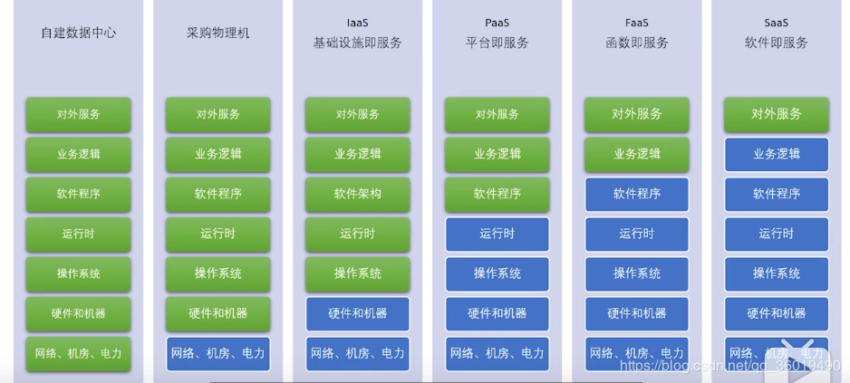

# LAAS，PAAS，SAAS，FAAS

aas 是 As-a-Service，即为服务的意思。

- IaaS：基础设施服务，Infrastructure-as-a-service
- PaaS：平台服务，Platform-as-a-service
- SaaS：软件服务，Software-as-a-service
- BaaS：Backend as a Service（后端即服务）

    服务商为客户(开发者)提供整合云后端的服务，如提供文件存储、数据存储、推送服务、身份验证服务等功能，以帮助开发者快速开发应用。

- FaaS：Function as a service（函数即服务）

    无服务器计算，当前使用最广泛的是AWS的Lambada。
    服务商提供一个平台，允许客户开发、运行和管理应用程序功能，而无需构建和维护通常与开发和启动应用程序相关的基础架构的复杂性。
    按照此模型构建应用程序是实现“无服务器”体系结构的一种方式，通常在构建微服务应用程序时使用。
- CaaS是Communications-as-a-Service缩写，意思是通讯即服务(也可称为协作即服务)。CaaS是将传统电信的能力如消息、语音、视频、会议、通信协同等封装成API(Application Programming Interface，应用软件编程接口)或者SDK(Software Development Kit，软件开发工具包)通过互联网对外开放，提供给第三方（企业、SME、垂直行业、CP/SP以及个人开发者等等）使用，将电信能力真正作为服务对外提供。

- MaaS(Machine as a Service)物联网即服务，这个概念伴随着物联网产生，物联网常见的两种业务形式就是MAI与MaaS，因此MaaS属于物联网业务形式的一种。
