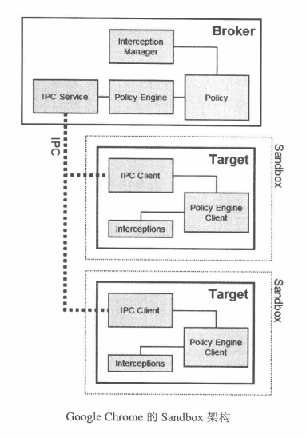

# 浏览器沙盒模型

（参考地址：https://www.cnblogs.com/slly/p/6639173.html）

## 由来

沙箱模型技术是浏览器和其他应用程序中保护安全的一种组件关系设计模式，最初发明人为GreenBorder公司。2007年5月，谷歌公司收购了该公司，也将此项专利应用于chrome浏览器的研发中。

## 定义

将网页的运行限制在一个特定的环境中，也就是一个沙箱中，使它只能访问有限的功能。那么，即使网页工作的渲染引擎被攻击，它也不能够获取渲染引擎工作的主机系统中的任何权限，这一思想就是沙箱模型。

## 原理

- “沙盒”技术与主动防御技术原理截然不同。
    - 主动防御是发现程序有可疑行为时立即拦截并终止运行。
    - “沙盒”技术则是发现可疑行为后让程序继续运行，当发现的确是病毒时才会终止。
- “沙盒”技术的实践运用流程是：
    - 让疑似病毒文件的可疑行为在虚拟的“沙盒”里充分表演，“沙盒”会记下它的每一个动作；
    - 当疑似病毒充分暴露了其病毒属性后，“沙盒”就会执行“回滚”机制：
    - 将病毒的痕迹和动作抹去，恢复系统到正常状态。

> - 病毒：先潜伏，观察形式
> - 沙盒：我就静静地看着你表演
> - 病毒：没人嘛，浪起来
> - 沙盒：拜拜了您嘞，收拾收拾，打扫战场，回归原位

## 实现

在Windows系统中，浏览器结合了
- DEP : Data Execution Prevention,数据执行保护,是windows下面针对内存防止内存缓冲区溢出执行恶意代码，提供的一项关于硬件相关的保护技术服务。其实从NT系统开始就已经集成了这个技术，经常我们有遇到某个程序被异常终止然后提示数据执行保护就是这个服务在起作用
- ASLR : Address space layout randomization，缩写ASLR，又称地址空间配置随机化、地址空间布局随机化。是一种防范内存损坏漏洞被利用的计算机安全技术。
    - ASLR通过随机放置进程关键数据区域的地址空间来防止攻击者能可靠地跳转到内存的特定位置来利用函数。现代操作系统一般都加设这一机制，以防范恶意程序对已知地址进行Return-to-libc攻击。
    - 地址空间配置随机加载利用随机方式配置数据地址空间，使某些敏感数据（例如操作系统内核）配置到一个恶意程序无法事先获知的地址，令攻击者难以进行攻击。
    - 定址空间（英语：Address space），又称为地址空间、地址空间，定义了某个范围内的离散地址，这些地址可能分别对应到某个网络节点、周边设备、扇区或是某个实体或是逻辑器件等等。在操作系统中，地址空间指的是某个特定进程，在存储器中所能够使用与控制的地址区块。
- SafeSEH：在调用异常处理函数之前，对要调用的异常处理函数进行一系列的有效性校验，如果发现异常处理函数不可靠（被覆盖了，被篡改了），立即终止异常处理函数的调用

等操作系统提供的保护技术，用于对抗内存攻击。与此同时，浏览器开发商还发展出多进程架构，使得安全性又有了很大的提高。*（注：由于沙箱模型严重依赖操作系统提供的技术，而不同的操作系统提供的安全技术是不一样的，这就意味着不同操作系统上的实现是不一致的。）*

- **Google Chrome**是第一个采取多进程架构的浏览器。
    - Chrome的主要进程氛围：
        - 浏览器进程，渲染进程，插件进程、拓展进程。
        - 插件进程如flash、pdf等于浏览器进程严格隔离，因此不会互相影响。
    - Chrome的渲染引擎由SandBox隔离，网页代码要与浏览器内核进程通信、与操作系统通信都需要通过IPC channel，在其中会进行一些安全检查。
    - 采用SandBox技术，可以让网页的渲染在一个独立的Renderer进程中进行，并且该进程是受限的
    - 受限环境只能被某些或者很少的系统调用而且不能直接访问用户数据。
    
    - 沙箱模型工作的基本单位就是进程。每一个进程对应一个沙箱。相对于单进程浏览器，在发生崩溃时，多进程浏览器只会崩溃当前的Tab页，而单进程浏览器则会崩溃整个浏览器进程。这对于用户体验式很大的提升。