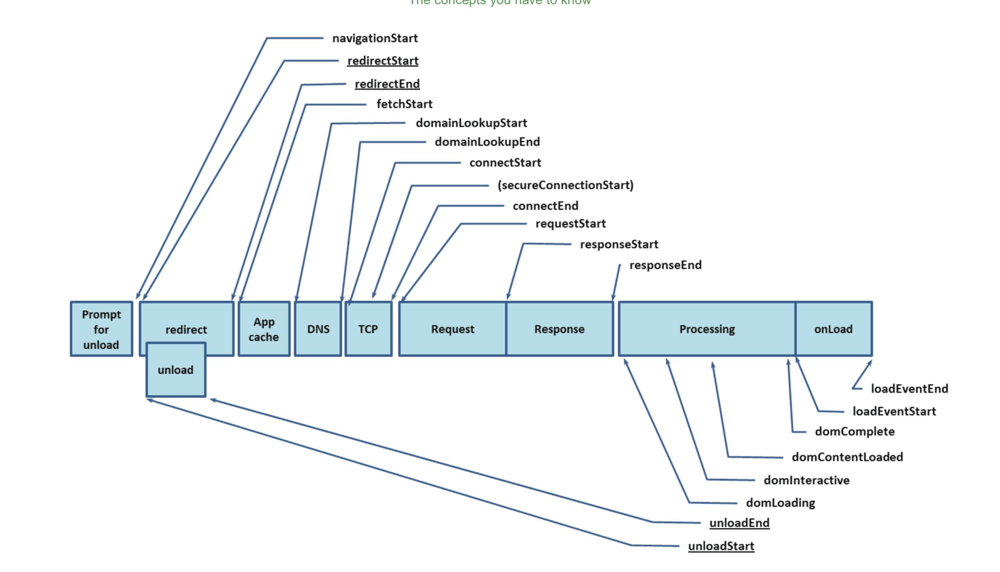

# 性能监控

浏览器处理请求会经历了下面这些阶段：重定向→拉取缓存→DNS查询→建立TCP链接→发起请求→接收响应→处理HTML元素→元素加载完成

PerformanceTiming中一些常用的计算:

- DNS查询耗时 ：domainLookupEnd - domainLookupStart
- TCP链接耗时 ：connectEnd - connectStart
- request请求耗时 ：responseEnd - responseStart
- 解析dom树耗时 ： domComplete - domInteractive
- 白屏时间 ：responseStart - navigationStart
- domready时间(用户可操作时间节点) ：domContentLoadedEventEnd - navigationStart
- onload时间(总下载时间) ：loadEventEnd - navigationStart

MemoryInfo是一个非标准属性

- jsHeapSizeLimit: 内存大小限制
- totalJSHeapSize: 可使用的内存
- usedJSHeapSize: JS对象(包括V8引擎内部对象)占用的内存，不能大于totalJSHeapSize，

performance.now()

- performance.now()方法返回当前网页从performance.timing.navigationStart到当前时间之间的微秒数，其精度可达100万分之一秒。
- performance.now()近似等于Date.now()，但前者返回的是毫秒，后者返回的是微秒，后者的精度比前者高1000倍。

performance.mark()

- performance.mark方法用于为相应的视点做标记。
- performance.clearMarks方法用于清除标记，如果不加参数，则清除所有标记。

performance.getEntries()

浏览器获取网页时，会对网页中每一个对象，如js文件、css文件、图片文件等，发出一个HTTP请求。performance.getEntries方法以数组形式，返回这些请求的时间统计信息。

performance.navigation.type

返回一个整数值，表示网页的加载来源，可能有以下4种：

- 0：网页通过点击链接、地址栏输入、表单提交、脚本操作等方式加载，相当于常数performance.navigation.TYPE_NAVIGATENEXT。
- 1：网页通过重新加载按钮或location.reload()方法加载，相当于常数performance.navigation.TYPE_RELOAD。
- 2：网页通过前进或后退按钮加载，相当于常数performance.navigation.TYPE_BACK_FORWARD。
- 255：任何其他来源的加载，相当于常数performance.navigation.TYPE_UNDEFINED。

performance.navigation.redirectCount

该属性表示当前网页经过了多少次重定向跳转。
