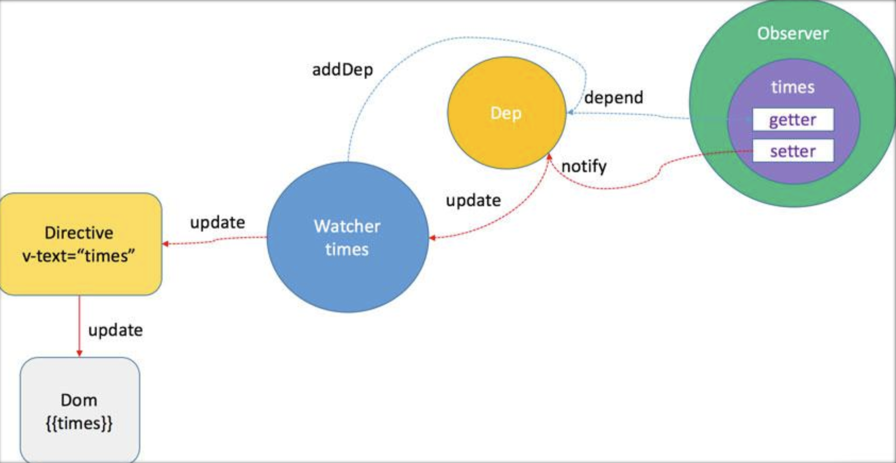

# vue2 的源码分析

先上一张图来镇楼



[具体源码分析](https://www.processon.com/view/link/5d9192cce4b0ca6e052c9c3a)

## 先捋一条线

以vue运行的过程为切入点

- 将vue文件分块编译，template、script、style
  - template 根据Node属性和正则匹配生成AST，解析出指令directive，一个指令对应一个watcher
  - script `new Vue` 将data代理到vm上，实例化Observer，生成`getter`、`setter`
  - 在`getter`中将对应的watcher添加到dep依赖收集中，
  - 在`setter`中执行dep中对应依赖的watcher的update
  - 组件本质上也是 `new Vue`
- 当数据改变时，触发`setter`，执行dep中对应依赖的watcher的update
  - 通过调度算法执行patch
  - DOM diff将需要更新的VNode添加到队列中
  - 更新渲染到页面上

## directive

vue 的 directive 包含

- v-model
- v-for
- v-show dom元素是否显示
- v-if dom元素是否存在
- v-else
- v-else-if
- v-bind 简写 `:`
- v-on 简写 `@`
- v-text
- v-html
- v-once 只渲染元素和组件一次
- v-cloak 防闪烁，这个指令保持在元素上直到关联实例结束编译，防止刷新页面，网速慢的情况下出现{{ message }}等数据格式
- v-pre  把标签内部的元素原位输出，跳过这个元素和它的子元素的编译过程

```javascript
Vue.directive('my-directive', {
  bind: function () {},//只调用一次，指令第一次绑定到元素时调用。在这里可以进行一次性的初始化设置。
  inserted: function () {},//被绑定元素插入父节点时调用 (仅保证父节点存在，但不一定已被插入文档中)。
  update: function () {},//所在组件的 VNode 更新时调用，但是可能发生在其子 VNode 更新之前。指令的值可能发生了改变，也可能没有。
  componentUpdated: function () {},//指令所在组件的 VNode 及其子 VNode 全部更新后调用。
  unbind: function () {}//只调用一次，指令与元素解绑时调用。
})
```

## html模版编译

编译html模版方法，举个栗子🌰

```html
<ul :class="bindCls" class="list" v-if="isShow">
    <li v-for="(item,index) in data" @click="clickItem(index)">{{item}}:{{index}}</li>
</ul>
```

如上的模板大致会生成如下的AST树

```javascript
ast = {
  'type': 1,
  'tag': 'ul',
  'attrsList': [],
  'attrsMap': {
    ':class': 'bindCls',
    'class': 'list',
    'v-if': 'isShow'
  },
  'if': 'isShow',
  'ifConditions': [{
    'exp': 'isShow',
    'block': // ul ast element
  }],
  'parent': undefined,
  'plain': false,
  'staticClass': 'list',
  'classBinding': 'bindCls',
  'children': [{
    'type': 1,
    'tag': 'li',
    'attrsList': [{
      'name': '@click',
      'value': 'clickItem(index)'
    }],
    'attrsMap': {
      '@click': 'clickItem(index)',
      'v-for': '(item,index) in data'
     },
    'parent': // ul ast element
    'plain': false,
    'events': {
      'click': {
        'value': 'clickItem(index)'
      }
    },
    'hasBindings': true,
    'for': 'data',
    'alias': 'item',
    'iterator1': 'index',
    'children': [
      'type': 2,
      'expression': '_s(item)+":"+_s(index)'
      'text': '{{item}}:{{index}}',
      'tokens': [
        {'@binding':'item'},
        ':',
        {'@binding':'index'}
      ]
    ]
  }]
}
```

整体来说它的逻辑就是循环解析 template ，用正则做各种匹配，对于不同情况分别进行不同的处理，直到整个 template 被解析完毕。

匹配的过程中主要利用了正则表达式，如下：

```javascript
const attribute = /^\s*([^\s"'<>\/=]+)(?:\s*(=)\s*(?:"([^"]*)"+|'([^']*)'+|([^\s"'=<>`]+)))?/
const ncname = '[a-zA-Z_][\\w\\-\\.]*'
const qnameCapture = `((?:${ncname}\\:)?${ncname})`
const startTagOpen = new RegExp(`^<${qnameCapture}`)
const startTagClose = /^\s*(\/?)>/
const endTag = new RegExp(`^<\\/${qnameCapture}[^>]*>`)
const doctype = /^<!DOCTYPE [^>]+>/i
const comment = /^<!\--/
const conditionalComment = /^<!\[/
```

生成AST元素，并添加了 namespace，其中，

- type 表示 AST 元素类型,文本构造的 AST 元素有 2 种类型，一种是有表达式的，type 为 2，一种是纯文本，type 为 3。
- tag 表示标签名，
- attrsList 表示属性列表，
- attrsMap 表示属性映射表，
- parent 表示父的 AST 元素，
- children 表示子 AST 元素集合。然后处理相应的指令

```javascript
processPre(element)
processRawAttrs(element)
// structural directives
processFor(element)
processIf(element)
processOnce(element)
// element-scope stuff
processElement(element, options)
...
```

因为我们知道 Vue 是数据驱动，是响应式的，但是我们的模板并不是所有数据都是响应式的，也有很多数据是首次渲染后就永远不会变化的，那么这部分数据生成的 DOM 也不会变化，我们可以在 patch 的过程跳过对他们的比对。

所以在编译阶段可以把一些 AST 节点优化成静态节点，所以整个 optimize 的过程实际上就干 2 件事情，`markStatic(root)` 标记静态节点 ，`markStaticRoots(root, false)` 标记静态根。

把整个 AST 树中的每一个 AST 元素节点标记了 `static` 和 `staticRoot`

对一个 AST 元素节点是否是静态的判断

- 如果是表达式，就是非静态；
- 如果是纯文本，就是静态；对于一个普通元素，
- 如果有 pre 属性，那么它使用了 v-pre 指令，是静态，
- 否则要同时满足以下条件：
  - 没有使用 v-if、v-for，没有使用其它指令（不包括 v-once），
  - 非内置组件，是平台保留的标签，
  - 非带有 v-for 的 template 标签的直接子节点，节点的所有属性的 key 都满足静态 key；

对于有资格成为 staticRoot 的节点，除了本身是一个静态节点外，必须满足拥有 children，并且 children 不能只是一个文本节点

最后一步就是把优化后的 AST 树转换成可执行的代码

上面的🌰生成的render代码如下

```javascript
with(this){
  return (isShow) ?
    _c('ul', {
        staticClass: "list",
        class: bindCls
      },
      _l((data), function(item, index) {
        return _c('li', {
          on: {
            "click": function($event) {
              clickItem(index)
            }
          }
        },
        [_v(_s(item) + ":" + _s(index))])
      })
    ) : _e()
}
```

其中

```javascript
export function installRenderHelpers (target: any) {
  target._o = markOnce
  target._n = toNumber
  target._s = toString
  target._l = renderList
  target._t = renderSlot
  target._q = looseEqual
  target._i = looseIndexOf
  target._m = renderStatic
  target._f = resolveFilter
  target._k = checkKeyCodes
  target._b = bindObjectProps
  target._v = createTextVNode
  target._e = createEmptyVNode
  target._u = resolveScopedSlots
  target._g = bindObjectListeners
}
```

## 响应式数据

Vue 2.x 利用 Object.defineProperty()，并且把内部解耦为 Observer, Dep, 并使用 Watcher 相连,不能兼容 IE8 及以下浏览器
Vue 在 3.x 版本之后改用 Proxy 进行实现, IE11 也 不能兼容

本文只对Vue 2.x的响应式数据原理进行分析

在 Vue 的初始化阶段，_init 方法执行的时候，会执行 initState(vm) 方法，对 props、methods、data、computed 和 wathcer 等属性做了初始化操作。

initData中给非 VNode 的对象类型数据添加一个 Observer

```javascript
/**
 * Observer class that is attached to each observed
 * object. Once attached, the observer converts the target
 * object's property keys into getter/setters that
 * collect dependencies and dispatch updates.
 */
export class Observer {
  value: any;
  dep: Dep;
  vmCount: number; // number of vms that has this object as root $data

  constructor (value: any) {
    this.value = value
    this.dep = new Dep()
    this.vmCount = 0
    def(value, '__ob__', this)
    if (Array.isArray(value)) {
      const augment = hasProto
        ? protoAugment
        : copyAugment
      augment(value, arrayMethods, arrayKeys)
      this.observeArray(value)
    } else {
      this.walk(value)
    }
  }

  /**
   * Walk through each property and convert them into
   * getter/setters. This method should only be called when
   * value type is Object.
   */
  walk (obj: Object) {
    const keys = Object.keys(obj)
    for (let i = 0; i < keys.length; i++) {
      defineReactive(obj, keys[i])
    }
  }

  /**
   * Observe a list of Array items.
   */
  observeArray (items: Array<any>) {
    for (let i = 0, l = items.length; i < l; i++) {
      observe(items[i])
    }
  }
}
```

最后都是汇总到遍历对象的 key 调用 defineReactive 方法

```javascript
export function defineReactive (
  obj: Object,
  key: string,
  val: any,
  customSetter?: ?Function,
  shallow?: boolean
) {
  const dep = new Dep()
  ...
  Object.defineProperty(obj, key, {
    enumerable: true,
    configurable: true,
    get: function reactiveGetter () {
      const value = getter ? getter.call(obj) : val
      if (Dep.target) {
        dep.depend()
        ...
      }
      return value
    },
    set: function reactiveSetter (newVal) {
      const value = getter ? getter.call(obj) : val
      /* eslint-disable no-self-compare */
      if (newVal === value || (newVal !== newVal && value !== value)) {
        return
      }
      /* eslint-enable no-self-compare */
      ...
      if (setter) {
        setter.call(obj, newVal)
      } else {
        val = newVal
      }
      ...
      dep.notify()
    }
  })
}
```

getter 做的事情是依赖收集，setter 做的事情是派发更新，

**注意：**

- 当我们去给这个对象添加一个新的属性的时候，是不能够触发它的 setter 的，Vue 为了解决这个问题，定义了一个全局 API `Vue.set` 方法
- Vue 也是不能检测到以下变动的数组：
  - 当你利用新的索引直接设置一个项时，例如：vm.items[indexOfItem] = newValue，可以使用：Vue.set(example1.items, indexOfItem, newValue)；
  - 当你修改数组的长度时，例如：vm.items.length = newLength，可以使用 vm.items.splice(newLength)。

在`defineReactive`中首先实例化一个 Dep 的实例

```javascript
export default class Dep {
  static target: ?Watcher;
  id: number;
  subs: Array<Watcher>;

  constructor () {
    this.id = uid++
    this.subs = []
  }

  addSub (sub: Watcher) {
    this.subs.push(sub)
  }

  removeSub (sub: Watcher) {
    remove(this.subs, sub)
  }

  depend () {
    if (Dep.target) {
      Dep.target.addDep(this)
    }
  }

  notify () {
    // stabilize the subscriber list first
    const subs = this.subs.slice()
    for (let i = 0, l = subs.length; i < l; i++) {
      subs[i].update()
    }
  }
}
```

它有一个静态属性 target，这是一个全局唯一 Watcher,同一时间只能有一个全局的 Watcher 被计算，另外它的自身属性 subs 也是 Watcher 的数组。

当我们在组件中对响应的数据做了修改，就会触发 setter 的逻辑，最后调用 dep.notify() 方法

也就是遍历所有的 subs，也就是 Watcher 的实例数组，然后调用每一个 watcher 的 update 方法

```javascript
class Watcher {
  // ...
  update () {
    /* istanbul ignore else */
    if (this.computed) {
      // A computed property watcher has two modes: lazy and activated.
      // It initializes as lazy by default, and only becomes activated when
      // it is depended on by at least one subscriber, which is typically
      // another computed property or a component's render function.
      if (this.dep.subs.length === 0) {
        // In lazy mode, we don't want to perform computations until necessary,
        // so we simply mark the watcher as dirty. The actual computation is
        // performed just-in-time in this.evaluate() when the computed property
        // is accessed.
        this.dirty = true
      } else {
        // In activated mode, we want to proactively perform the computation
        // but only notify our subscribers when the value has indeed changed.
        this.getAndInvoke(() => {
          this.dep.notify()
        })
      }
    } else if (this.sync) {
      this.run()
    } else {
      queueWatcher(this)
    }
  }
}  
```

它并不会每次数据改变都触发 watcher 的回调，而是把这些 watcher 先添加到一个队列里，然后在 nextTick 后执行 flushSchedulerQueue。

- 组件的更新由父到子；因为父组件的创建过程是先于子的，所以 watcher 的创建也是先父后子，执行顺序也应该保持先父后子。
- 用户的自定义 watcher 要优先于渲染 watcher 执行；因为用户自定义 watcher 是在渲染 watcher 之前创建的。
- 如果一个组件在父组件的 watcher 执行期间被销毁，那么它对应的 watcher 执行都可以被跳过，所以父组件的 watcher 应该先执行。

`next-tick.js`

- 申明了 microTimerFunc 和 macroTimerFunc 2 个变量，它们分别对应的是 micro task 的函数和 macro task 的函数。
- 对于 macro task 的实现，
  - 优先检测是否支持原生 setImmediate，这是一个node支持的特性，
  - 不支持的话再去检测是否支持原生的 MessageChannel，
  - 如果也不支持的话就会降级为 setTimeout 0；
- 而对于 micro task 的实现，
  - 则检测浏览器是否原生支持 Promise，
  - 不支持的话直接指向 macro task 的实现。
  