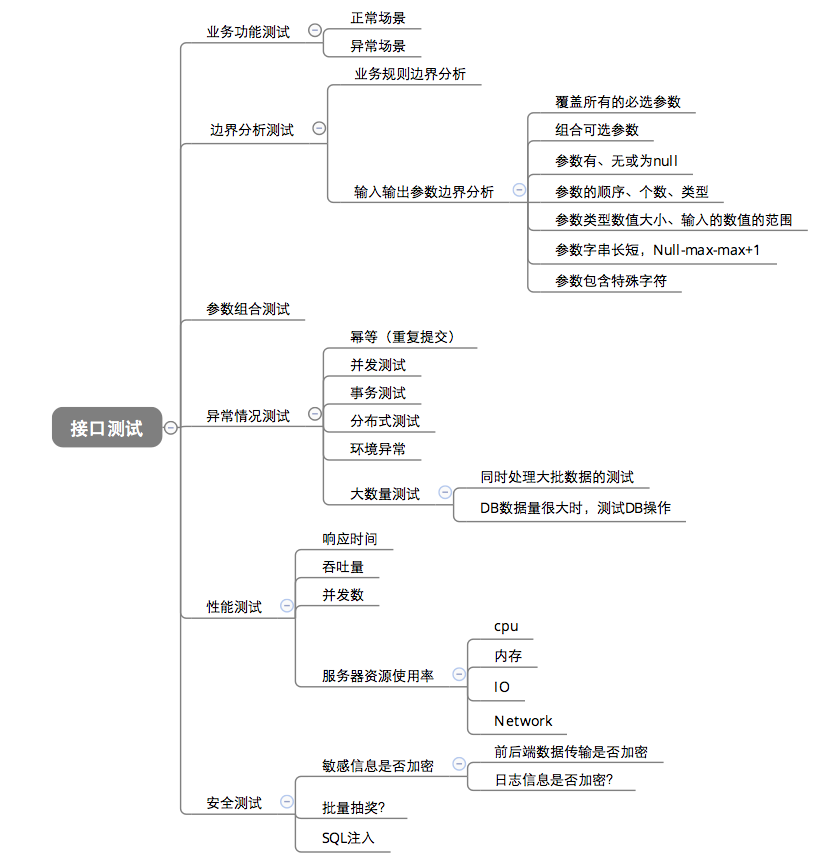
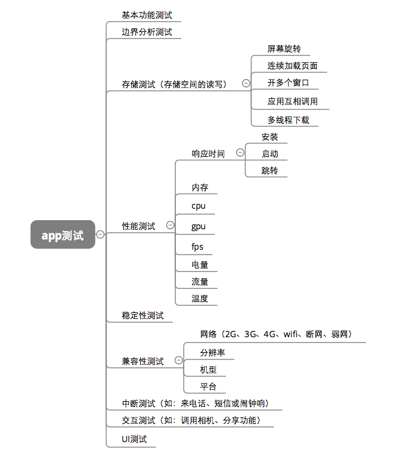

# 单元测试，接口测试，e2e测试，ui测试

## 单元测试

单元测试是用来对一个模块、一个函数或者一个类来进行正确性检验的测试工作。

单元测试（也称为“提交测试”），是由开发人员编写的小型的专项测试，以确保新代码独立工作。“独立”这里意味着不依赖或调用其它不可直接访问的代码，也不依赖外部数据源或其它模块。如果运行代码需要这样的依赖关系，那么这些资源可以用模拟来表示。模拟是指使用看起来像资源的代码存根，可以返回值，但不实现任何功能。

通常，这些测试采用断言形式，即函数或方法的给定输入集产生给定的输出集。它们通常进行测试以确保正确标记和处理出错条件。

最常见的测试目标是是验证“自己写的一小段代码是不是符合设计逻辑的“。

单元测试会为我们的承诺做保证。编写单元测试就是用来验证这段代码的行为是否与我们期望的一致。有了单元测试，我们可以自信的交付自己的代码。

### 测试用例设计

测试用例的核心是输入数据。预期输出是依据输入数据和程序功能来确定的，也就是说，对于某一程序，输入数据确定了，预期输出也就可以确定了

我们应该用一定的规则选择有代表性的数据作为输入数据，主要有三种：正常输入，边界输入，非法输入

## 接口测试

接口测试是测试系统组件间接口的一种测试。接口测试主要用于检测外部系统与系统之间以及内部各个子系统之间的交互点。测试的重点是要检查数据的交换，传递和控制管理过程，以及系统间的相互逻辑依赖关系等。

接口一般分为两种：1.程序内部的接口 2.系统对外的接口

- 系统对外的接口：比如你要从别的网站或服务器上获取资源或信息，别人肯定不会把数据库共享给你，他只能给你提供一个他们写好的方法来获取数据，你引用他提供的接口就能使用他写好的方法，从而达到数据共享的目的。

- 程序内部的接口：方法与方法之间，模块与模块之间的交互，程序内部抛出的接口，比如bbs系统，有登录模块、发帖模块等等，那你要发帖就必须先登录，那么这两个模块就得有交互，它就会抛出一个接口，供内部系统进行调用。




- 边界分析测试

    前端的输入输出很多时候都是提供固守的值让用户选择（如下拉框），在这种情况下测试的边界范围就非常有限，但接口测试就不存在这方面的限制，相对来说接口可以覆盖的范围更广，同样的，接口出现问题的概率也更高。
- 性能测试

    App端性能主要关注与手机相关的特性，如手机cpu、内存、流量、fps等。而接口性能主要关注接口响应时间、并发、服务端资源的使用情况等

- 接口测试和app测试的活动有部分重复的内容，主要集中在业务功能测试方面。除此之外，针对各自特性的测试都不一样，需要分别进行有针对性的测试，才能确保整个产品的质量。
- 接口测试可以关注于服务器逻辑验证，而UI测试可以关注于页面展示逻辑及界面前端与服务器集成验证

- 接口测试质量评估标准
  - 业务功能覆盖是否完整
  - 业务规则覆盖是否完整
  - 参数验证是否达到要求（边界、业务规则）
  - 接口异常场景覆盖是否完整
  - 接口覆盖率是否达到要求
  - 代码覆盖率是否达到要求
  - 性能指标是否满足要求
  - 安全指标是否满足要求

## e2e测试

E2E（End To End）即端对端测试，属于黑盒测试，通过编写测试用例，自动化模拟用户操作，确保组件间通信正常，程序流数据传递如预期。

名称 | 断言 | 是否跨浏览器支持 | 实现 | 官网 | 是否开源
-- | -- | -- | -- | -- | --
nightwatch | assert 和 Chai Expect | 是 | selenium | `http://nightwatchjs.org/` | 是
cypress | Chai、Chai-jQuery 等 | 否 | Chrome | `https://www.cypress.io/` | 是
testcafe | 自定义的断言 | 是 | 不是基于 selenium 实现 | `https://devexpress.github.io/testcafe/` | 是
katalon | TDD/BDD | 是 | 未知 | `https://www.katalon.com/katalon-studio/` | 否

nightwatch示例

安装
`npm i selenium-server nightwatch chromedriver -D`

```javascript
module.exports = {
  'default e2e tests': function (browser) {
    const devServer = browser.globals.devServerURL
    browser
      .url('http://www.google.com') // 打开地址
      .waitForElementVisible('body', 1000) // 等待界面显示
      .assert.title('Google') // 断言title为Google
      .assert.visible('input[type=text]') // 断言输入框显示
      .setValue('input[type=text]', 'rembrandt van rijn') // 设置输入框的值
      .waitForElementVisible('button[name=btnG]', 1000) // 等待按钮显示
      .click('button[name=btnG]') // 点击按钮
      .pause(1000) // 暂停等待请求
      .assert.containsText('ol#rso li:first-child', 'Rembrandt - Wikipedia')
// 断言包含字符串
      .end()
  }
}
```

## ui测试

用户界面测试主要是拿待测网页和设计稿进行对比
