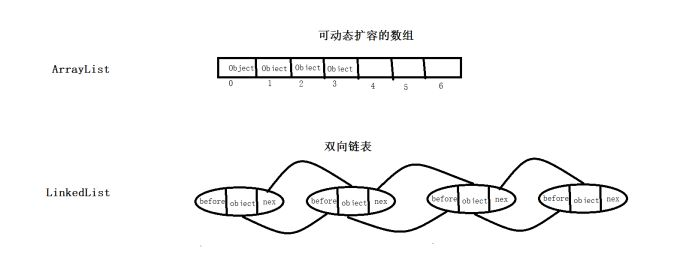

# ArrayList和LinkedList区别

## 结构tree

Iterable 迭代器可用接口

Collection 它继承了Iterable，所以，它包含了迭代器的相关内容。其次，它定义了集合的一些基础方法，如获取集合大小，判空，添加元素，删除元素等。

list 列表，作为集合的子类，列表相关子类的父类，它对列表的相关操作方法进行了细化，并添加了一些列表特有的操作。

ArrayList和LinkedList都实现了List接口

“ArrayList查询快、LinkedList添加删除快”

## ArrayList

基于动态数组的数据结构,而数组是一段连续的内存空间,因为数组在存储数据时是按顺序存储的，存储数据的内存也是连续的，所以他的特点就是**寻址读取数据比较容易，插入和删除比较困难**。

- 在读取数据时，只需要告诉数组要从哪个位置（索引）取数据就可以了，数组会直接把你想要的位置的数据取出来给你。

- 插入和删除比较困难是因为这些存储数据的内存是连续的，要插入和删除就需要变更整个数组中的数据的位置。 比如：但现在你需要往4中插入一个数据，那就代表着从4开始，后面的所有内存中的数据都要往后移一个位置，这可是很耗时的。

## linkedList

使用基于链表的数据结构实现存储，双向的链表结构。

当需要在首位置插入元素时，first 引用指向需要插入到链表中的节点对象，新的节点对象的next引用指向原先的首节点对象；

所以，对于LinkedList，它在插入、删除集合中任何位置的元素所花费的时间都是一样的，但是它根据索引查询一个元素的时候却比较慢。

查询 get(index)

判断index值是否大于总数的一半。

如果小于，则从first节点向后遍历，直到找到index节点，然后返回该节点的值。

如果大于，则从last节点向前遍历，直到找到index节点，然后返回该节点的值。

## 对比

1. ArrayList使用数组存储元素，因此在查询时速度较快，直接返回该位置的元素即可，时间复杂度为O(1);而LinkedList使用双向链表存储元素，在查询时需要从头或者尾遍历至查询元素，时间复杂度为O(n/2);

2. 还是因为存储方式的问题，ArrayList在插入或者删除时，需要移动插入位置之后的所有元素，因此速度较慢，时间复杂度为O(n)。而LinkedList只需要找到该位置，移动”指针”即可,时间复杂度为O(1)。

方法 | ArrayList | LinkedList
-- | -- | --
get | O(1) | O(n)
add 直接在后面添加 | O(1) | O(1)
add 在第几个后面插入 | 后面的元素需要向后移动 O(n) | 需要先找到第几个元素，直接指针指向操作 O(n)
remove | 后面的元素需要逐个移动 O(n) | O(1)

3. ArrayList的空间浪费主要体现在在list列表的结尾预留一定的容量空间，而LinkedList的空间花费则体现在它的每一个元素都需要消耗相当的空间

## 扩容

ArrayList和LinkedList都是有size的

**ArrayList：**

每次扩容后的大小为之前的1.5倍。然后会重新分配数据的位置

**LinkedList：**

由于LinkedList是一个双向链表，因此不需要扩容机制，直接在前后添加元素即可。
